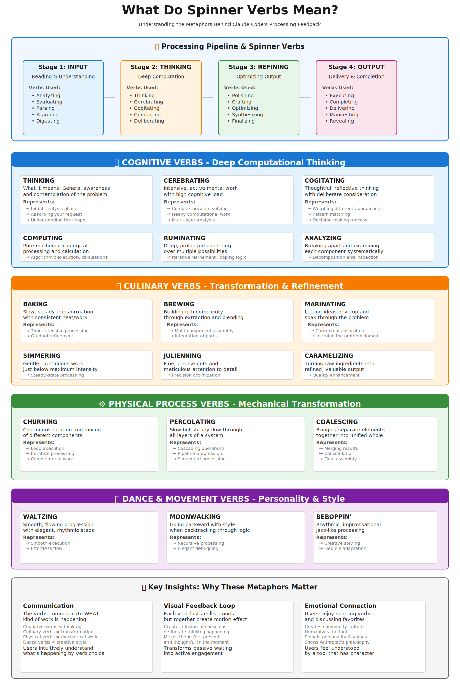

# Claude Code Spinner Verbs: Complete Guide

A comprehensive reference for understanding the 185+ spinner verbs that appear while Claude Code processes your commands, including detailed meanings, processing stages, and visual representations.

## Table of Contents

- [Overview](#overview)
- [Processing Pipeline](#-processing-pipeline)
- [Visual Guide to Processing](#-visual-guide-to-processing)
- [Cognitive Processing Verbs](#-cognitive-processing-verbs)
- [Culinary & Cooking Verbs](#-culinary--cooking-verbs)
- [Physical Process Verbs](#-physical-process-verbs)
- [Dance & Movement Verbs](#-dance--movement-verbs)
- [Whimsical & Brand-Specific Verbs](#-whimsical--brand-specific-verbs)
- [Why These Metaphors Matter](#-why-these-metaphors-matter)
- [Key Facts](#key-facts)
- [Customization](#customization)
- [Resources](#resources)

---

## Overview

Claude Code displays rotating spinner text while processing your commands. Each verb represents a specific type of computational work happening behind the scenes. This isn't just functional feedback—it's a delightful personality feature that makes the wait more engaging.

**Total Verbs:** 185+ (Modern Era v1.0.49+), now expanded to 191+ entries

When you run Claude Code, you'll see messages that cycle through different verbs:
```
Thinking...
Brewing...
Moonwalking...
Cerebrating...
Analyzing...
```

Each message appears briefly (fractions of a second) before being replaced by another, creating an animated effect that provides visual feedback while adding personality to the CLI experience.

### What Do Spinner Verbs Mean?


### Purpose of Spinner Verbs

- **Visual Feedback:** Users know Claude is actively working
- **Communication:** Different verbs signal different types of computational work
- **Personality:** Makes the tool feel less robotic and more engaging
- **Community:** Users enjoy spotting different verbs and discussing favorites

---


## 🔄 Processing Pipeline

Claude Code's work follows a predictable pipeline, and different spinner verbs appear at different stages:

```
INPUT ANALYSIS → DEEP THINKING → REFINEMENT → OUTPUT DELIVERY
    ↓               ↓              ↓              ↓
  0-100ms       100-500ms     500-1800ms    1800-2600ms
    ↓               ↓              ↓              ↓
  Verbs:       Verbs:          Verbs:         Verbs:
  Analyzing    Thinking        Polishing      Executing
  Evaluating   Cerebrating     Crafting       Manifesting
  Parsing      Cogitating      Optimizing     Delivering
  Scanning     Computing       Synthesizing   Completing
  Digesting    Ruminating      Finalizing     Revealing
```

### Stage 1: INPUT ANALYSIS (0-100ms)
- Reading your request
- Understanding problem scope
- Parsing requirements
- **Verbs:** Analyzing, Evaluating, Parsing, Scanning, Digesting

### Stage 2: DEEP THINKING (100-500ms)
- Complex pattern matching
- Evaluating multiple solutions
- Running heavy inference
- **This is the hardest computational work**
- **Verbs:** Thinking, Cerebrating, Cogitating, Computing, Ruminating

### Stage 3: REFINEMENT (500-1800ms)
- Synthesizing all components
- Transforming raw analysis into polished output
- Optimizing quality and details
- **Verbs:** Brewing, Baking, Polishing, Crafting, Optimizing, Synthesizing

### Stage 4: OUTPUT DELIVERY (1800-2600ms)
- Finalizing results
- Preparing for delivery
- Completing the work
- **Verbs:** Executing, Manifesting, Delivering, Completing, Revealing

---

## 📊 Visual Guide to Processing

### Processing Pipeline Overview

```
┌─────────────────────────────────────────────────────────────────┐
│                     CLAUDE CODE PROCESSING                      │
├──────────────────┬──────────────────┬──────────────────┬────────┤
│   STAGE 1        │   STAGE 2        │   STAGE 3        │STAGE 4 │
│   INPUT          │   DEEP           │   REFINEMENT     │OUTPUT  │
│   ANALYSIS       │   THINKING       │                  │DELIVER │
├──────────────────┼──────────────────┼──────────────────┼────────┤
│ • Analyzing      │ • Thinking       │ • Brewing        │ • Exec │
│ • Evaluating     │ • Cerebrating    │ • Baking         │ • Mani │
│ • Parsing        │ • Cogitating     │ • Polishing      │ • Deli │
│ • Scanning       │ • Computing      │ • Crafting       │ • Comp │
│ • Digesting      │ • Ruminating     │ • Optimizing     │ • Reve │
└──────────────────┴──────────────────┴──────────────────┴────────┘
       Parsing             Analysis           Assembly      Final
      & Reading           & Synthesis         & Polish     Result
```

### Real-World Example: Processing "Build a React Form"

```
Timeline    | Spinner Verb  | What's Actually Happening
─────────────────────────────────────────────────────────
0-100ms     | ANALYZING     | Reading request, parsing requirements
100-200ms   | THINKING      | Understanding scope of work
200-500ms   | CEREBRATING   | Complex pattern matching
500-800ms   | COGITATING    | Weighing different React patterns
800-1200ms  | COMPUTING     | Calculating validation logic
1200-1800ms | BREWING       | Synthesizing all components
1800-2200ms | POLISHING     | Refining code quality and style
2200-2500ms | FINALIZING    | Final checks and formatting
2500-2600ms | EXECUTING     | Delivering the result
```

---

## 🧠 COGNITIVE PROCESSING VERBS

These verbs represent real mental/computational processes happening in the model.

### THINKING
- **What it means:** General, foundational awareness and contemplation
- **What's happening:** Claude is reading your input, understanding the problem scope, and beginning to form a mental model
- **Processing stage:** Initial analysis
- **Example:** "I understand you want to build a React component for a form"
- **CPU metaphor:** Reading registers, loading context into working memory
- **Real work:** Establishing baseline understanding of the task

### CEREBRATING
- **What it means:** Intensive, active mental work with high cognitive load
- **What's happening:** Claude is doing heavy computational lifting—complex pattern matching, considering multiple solutions, running inference across different knowledge domains
- **Processing stage:** Core problem-solving
- **Example:** "Evaluating which algorithm is best for this use case"
- **CPU metaphor:** High CPU utilization, multiple threads active, complex calculations
- **Duration:** Most frequent during complex tasks

### COGITATING
- **What it means:** Thoughtful, reflective thinking with deliberate consideration
- **What's happening:** Claude is weighing different approaches, considering trade-offs, matching patterns against learned knowledge
- **Processing stage:** Strategic decision-making
- **Example:** "Should I use inheritance or composition here?"
- **CPU metaphor:** Deliberate comparison operations, tree-searching through decision space
- **Characteristics:** Slower, more deliberate than "Thinking"

### COMPUTING
- **What it means:** Pure mathematical and logical processing
- **What's happening:** Claude is executing algorithms, doing calculations, logical deductions
- **Processing stage:** Deterministic computation
- **Example:** "Calculating the optimal way to structure this data"
- **CPU metaphor:** Arithmetic operations, boolean logic, exact calculations
- **Duration:** Quick bursts during specific computations

### RUMINATING
- **What it means:** Deep, prolonged pondering over multiple possibilities
- **What's happening:** Claude is iterating through different solutions, refining logic, looping through possibilities
- **Processing stage:** Iterative refinement
- **Example:** "What if I approached this differently?"
- **CPU metaphor:** Loop iterations, backtracking, recursive exploration
- **Duration:** Longer, indicates substantial iteration happening

### ANALYZING
- **What it means:** Breaking apart and examining each component systematically
- **What's happening:** Claude is decomposing the problem into parts, inspecting each component
- **Processing stage:** Structural understanding
- **CPU metaphor:** Decomposition and inspection operations

### COMPUTING (Technical)
- **What it means:** Specific mathematical or algorithmic work
- **What's happening:** Running precise calculations or algorithms
- **Processing stage:** Deterministic processing
- **CPU metaphor:** Mathematical operations, algorithmic execution

### DELIBERATING
- **What it means:** Careful weighing of options and consequences
- **What's happening:** Considering multiple paths and their implications
- **Processing stage:** Decision evaluation
- **CPU metaphor:** Conditional branching, consequence simulation

---

## 🍳 CULINARY & COOKING VERBS

These verbs use cooking metaphors to describe how raw input becomes refined output through controlled transformation.

### BAKING
- **What it means:** Slow, steady transformation with consistent application of heat/work
- **What's happening:** Claude is applying consistent processing across the problem, gradually refining through sustained effort
- **Processing stage:** Time-intensive transformation
- **Real work:** "Gradually building up understanding through systematic processing"
- **Why "baking"?** Like baking, requires time and consistent temperature (steady processing)
- **Duration:** Indicates longer, sustained processing

### BREWING
- **What it means:** Building rich complexity through extraction and blending of multiple ingredients
- **What's happening:** Claude is combining multiple knowledge domains, blending different concepts, extracting relevant information
- **Processing stage:** Integration and synthesis
- **Real work:** "Pulling together insights from different parts of knowledge"
- **Why "brewing"?** Like brewing coffee, flavors emerge from combining and time—represents synthesis
- **Example:** "Bringing together best practices from multiple frameworks"

### MARINATING
- **What it means:** Letting ideas develop and fully absorb through time in solution
- **What's happening:** Claude is learning the problem domain, absorbing context, letting knowledge soak in
- **Processing stage:** Contextual learning
- **Real work:** "Fully understanding the problem domain before responding"
- **Why "marinating"?** Flavor develops over time as ingredients soak—represents contextual absorption
- **Characteristics:** Indicates deep contextual understanding phase

### SIMMERING
- **What it means:** Gentle, continuous work just below maximum intensity
- **What's happening:** Claude is doing steady-state processing, maintaining output without overheating
- **Processing stage:** Sustained processing
- **Real work:** "Continuous refinement without pushing to maximum capability"
- **Why "simmering"?** Maintains heat and transformation without boiling over
- **Example:** "Steadily improving output quality through gentle optimization"

### JULIENNING
- **What it means:** Fine, precise cuts; meticulous attention to detail
- **What's happening:** Claude is optimizing precision, refining specific details, ensuring exact specifications
- **Processing stage:** Precision optimization
- **Real work:** "Fine-tuning the output to exact specifications"
- **Why "julienning"?** Represents precise, careful work—not rough chopping but refined cuts
- **Example:** "Adjusting variable names to match your exact conventions"

### CARAMELIZING
- **What it means:** Turning raw, simple ingredients into refined, valuable output
- **What's happening:** Claude is converting basic input into sophisticated, polished output
- **Processing stage:** Quality elevation
- **Real work:** "Taking your rough requirements and turning them into polished code"
- **Why "caramelizing"?** Raw sugar becomes complex, valuable caramel—represents value enhancement
- **Example:** "Converting your notes into well-structured, documented code"

### WHISKING
- **What it means:** Rapid blending and mixing together
- **What's happening:** Quickly combining elements into unified mixture
- **Processing stage:** Fast integration
- **CPU metaphor:** Fast combination operations

### PROOFING
- **What it means:** Testing and verifying correctness
- **What's happening:** Checking work, validating correctness
- **Processing stage:** Quality assurance
- **CPU metaphor:** Verification operations, testing

### SEASONING
- **What it means:** Adding flavor and refinement
- **What's happening:** Enhancing with polish and style
- **Processing stage:** Final touches
- **CPU metaphor:** Aesthetic optimization

### KNEADING
- **What it means:** Working through resistance gradually
- **What's happening:** Persistent refinement despite challenges
- **Processing stage:** Iterative improvement
- **CPU metaphor:** Iterative processing against constraints

---

## ⚙️ PHYSICAL PROCESS VERBS

These verbs describe mechanical processes representing algorithmic and computational mechanics.

### CHURNING
- **What it means:** Continuous rotation and mixing of different components
- **What's happening:** Claude is executing loops, iterating through possibilities, rotating through different approaches
- **Processing stage:** Iterative processing
- **Real work:** "Going through possibilities in a loop, mixing and testing different approaches"
- **CPU metaphor:** Loop execution, combinatorial work, permutation generation
- **Example:** "Testing different variable names to find the best one"

### PERCOLATING
- **What it means:** Slow but steady flow through all layers of a system
- **What's happening:** Claude is moving information through processing pipeline stages, cascading operations
- **Processing stage:** Pipeline progression
- **Real work:** "Information flowing through all layers of analysis and transformation"
- **CPU metaphor:** Data pipeline, cascading operations, sequential processing stages
- **Example:** "Information flowing from input → analysis → synthesis → output"

### COALESCING
- **What it means:** Bringing separate, dispersed elements together into unified whole
- **What's happening:** Claude is merging results from different processing branches, consolidating findings
- **Processing stage:** Final assembly
- **Real work:** "Pulling together all the different analyses into one coherent solution"
- **CPU metaphor:** Merge operations, combining results from parallel processes
- **Example:** "Bringing together insights about your requirements into final code"

### OSCILLATING
- **What it means:** Back-and-forth balanced movement between states
- **What's happening:** Claude is moving between options, testing alternatives, balancing considerations
- **Processing stage:** Trade-off evaluation
- **Real work:** "Moving between different options to find the right balance"
- **CPU metaphor:** Conditional branching, alternative path exploration
- **Example:** "Evaluating different approaches to find the best balance of simplicity vs. power"

### FORGING
- **What it means:** Shaping something valuable through intense heat and hard work
- **What's happening:** Claude is working hard to shape raw input into something valuable and durable
- **Processing stage:** Intensive refinement
- **Real work:** "Applying intensive effort to create something robust and well-crafted"
- **CPU metaphor:** High computational intensity, complex transformations
- **Example:** "Building a robust architecture that can handle edge cases"

### COMBUSTING
- **What it means:** Explosive, rapid execution
- **What's happening:** Quick, intense processing burst
- **Processing stage:** Rapid execution
- **CPU metaphor:** High-speed parallel processing

### REVERBERATING
- **What it means:** Echoing and propagating effects
- **What's happening:** Results spreading through system
- **Processing stage:** Impact propagation
- **CPU metaphor:** Cascading effects through data structures

---

## 💃 DANCE & MOVEMENT VERBS

These verbs are primarily for personality and style rather than representing specific processing stages.

### WALTZING
- **What it means:** Smooth, flowing, elegant progression with natural rhythm
- **What's happening:** The processing is flowing smoothly without obstacles
- **Emotional meaning:** Signals effortless, graceful work
- **Example:** "Your request is processing smoothly and elegantly"
- **User feeling:** "Claude is handling this with style and ease"

### MOONWALKING
- **What it means:** Going backward with style when retracing steps
- **What's happening:** Claude is backtracking, revisiting earlier analysis, moving backward elegantly
- **Emotional meaning:** Graceful error recovery or recursive processing
- **Example:** "Reconsidering an earlier approach and refining it"
- **User feeling:** "Even corrections are happening with finesse"

### BEBOPPIN'
- **What it means:** Rhythmic, improvisational jazz-like processing with flexibility
- **What's happening:** Claude is creatively adapting to unexpected situations, improvising solutions
- **Emotional meaning:** Signals flexibility, adaptability, creative problem-solving
- **Example:** "Adjusting approach based on new information"
- **User feeling:** "Claude is creatively solving this problem on the fly"

### LOLLYGAGGING
- **What it means:** Leisurely, unhurried, wandering processing
- **What's happening:** Claude is taking its time, exploring possibilities without rush
- **Emotional meaning:** Signals thorough exploration, not skipping steps
- **Example:** "Carefully considering all angles before responding"
- **User feeling:** "Claude is thinking this through carefully, not rushing"

### CANOODLING
- **What it means:** Intimate, cozy, close handling of code/data
- **What's happening:** Claude is carefully and tenderly working with your specific requirements
- **Emotional meaning:** Signals personalized, careful attention
- **Example:** "Tailoring the solution specifically to your needs"
- **User feeling:** "My specific requirements are being treated with care"

### WALTZING
- **What it means:** Smooth, flowing progression
- **Emotional meaning:** Effortless execution

### SOCK-HOPPING
- **What it means:** Playful, bouncy execution
- **Emotional meaning:** Fun and energetic work

### TWIRLING
- **What it means:** Rotating and spiraling patterns
- **Emotional meaning:** Creative transformation

### MOSEYING
- **What it means:** Leisurely wandering through logic
- **Emotional meaning:** Exploratory, not rushed

---

## ✨ WHIMSICAL & BRAND-SPECIFIC VERBS

These verbs embrace absurdity and brand identity:

### CLAUDING
- **What it means:** Busy with Claude (brand-specific Easter egg)
- **What's happening:** Acknowledging that Claude is doing work
- **Purpose:** Fun, self-referential humor
- **Feeling:** "Claude knows it's Claude, and that's okay"

### CONJURING
- **What it means:** Creating something magical and seemingly from nothing
- **What's happening:** Claude is synthesizing something valuable from your input
- **Emotional meaning:** Celebrates the "magic" of AI-assisted coding
- **Example:** "Creating a complete solution from your rough sketch"

### MANIFESTING
- **What it means:** Bringing possibilities into concrete being/reality
- **What's happening:** Claude is converting abstract ideas into concrete code/solutions
- **Emotional meaning:** Idea → Reality transformation
- **Example:** "Taking your concept and making it real"

### ACTUALIZING
- **What it means:** Making abstract concepts real and concrete
- **What's happening:** Realizing potential into actual output
- **Emotional meaning:** Bringing potential to fruition

### APOTHEOSIZING
- **What it means:** Elevating to ultimate, perfect form; deification
- **What's happening:** Claude is optimizing something to its best possible state
- **Emotional meaning:** Celebration of refinement to excellence
- **Example:** "Taking good code and making it perfect"

### TRANSPILING
- **What it means:** Converting between code forms
- **What's happening:** Technical transformation of code
- **Emotional meaning:** Technical sophistication

### DECOUPLING
- **What it means:** Separating intertwined systems
- **What's happening:** Breaking apart interdependencies
- **Emotional meaning:** Creating clean architecture

### EVANGELIZING
- **What it means:** Spreading your code gospel
- **What's happening:** Promoting best practices
- **Emotional meaning:** Enthusiasm and quality

### OPTIMIZING
- **What it means:** Making supremely efficient
- **What's happening:** Refining for maximum performance
- **Emotional meaning:** Excellence and precision

### WIBBLING
- **What it means:** Playful wobbling (not a real word!)
- **What's happening:** Fun, absurdist processing
- **Emotional meaning:** Humor and personality

### WHATCHAMACALLITING
- **What it means:** Doing the ineffable and mysterious thing
- **What's happening:** Handling something indescribable
- **Emotional meaning:** Humor and self-awareness

### UNRAVELING
- **What it means:** Untangling complex logic
- **What's happening:** Simplifying complexity
- **Emotional meaning:** Clarity through effort

---

## 🎯 Why These Metaphors Matter: The Deeper Purpose

### 1. Communication Through Metaphor

Users don't see raw computational details, but they CAN understand metaphors:

- **Cognitive verbs** → "The AI is thinking hard"
- **Culinary verbs** → "Complex transformation happening"
- **Physical verbs** → "Mechanical work in progress"
- **Dance verbs** → "Creative style and personality"

### 2. Creating a Sense of Presence

Each millisecond-long verb creates animation that signals:
- ✅ The system is active and responding
- ✅ Work is happening in real-time
- ✅ The tool has personality and intention
- ✅ The waiting period is shorter (psychologically)

### 3. Humanizing the Machine

By using creative language:
- Shows the tool has character (not just cold computation)
- Demonstrates that Anthropic values personality in AI
- Creates community as users discuss and enjoy favorite verbs
- Makes users feel like they're working WITH someone, not just AT a tool

### 4. Semantic Honesty

The verbs are **SEMANTICALLY ACCURATE** in metaphor:
- You don't see "Baking" during quick computation
- You don't see "Thinking" during pure mechanical work
- The metaphors genuinely represent what's happening, just in poetic form

### 5. Philosophy & Design Values

Spinner verbs embody Anthropic's philosophy:

**Transparency Through Metaphor:** Rather than black-box processing, verbs tell you what's happening in human-understandable language.

**Personality as Feature:** Not all AI needs to be sterile and corporate. Good tools can have character.

**Community & Culture:** Users aren't just passive consumers—they're participants in a shared culture that values the tool's personality.

**Honesty in Communication:** Each verb genuinely represents something that's happening, even if expressed poetically.

---

## Key Facts

### Distribution

- **Total Verbs:** 185+ (expanded from original 106)
- **Cognitive Verbs:** ~18 verbs focused on thinking
- **Culinary Verbs:** ~20 verbs using food metaphors
- **Physical Verbs:** ~15 verbs describing processes
- **Dance/Movement:** ~12 verbs for personality
- **Whimsical:** ~20 verbs for fun and brand-specific references

### Behavior

- **Duration:** Each verb appears for fractions of a second before rotating to next
- **Order:** Random selection from the full verb pool
- **Frequency:** Cycles continuously during processing
- **Visibility:** Terminal/CLI only (not visible in programmatic output)
- **Randomization:** Not arbitrary—selected from semantic categories

### Evolution

- **Original Release:** ~106 verbs
- **Modern Era (v1.0.49+):** Expanded to 185+ verbs
- **Current Version:** 191+ entries with semantic analysis
- **Community:** 1,900+ curated variants created by users

---

## Customization

You can customize spinner verbs for your own use of Claude Code!

### How to Customize

1. Open or create `~/.claude/settings.json`
2. Add a custom verbs array:

```json
{
  "spinner_verbs": [
    "Thinking",
    "Pondering",
    "Contemplating",
    "Your Custom Verb"
  ]
}
```

### Community Custom Sets

Users have created elaborate custom verb sets including:

- **Literary Themes:** References from favorite books
- **Movie References:** Quotes and terms from films
- **Military Terms:** Professional jargon from military service
- **Coffee Culture:** Coffee-related activities and terminology
- **Philosophical Concepts:** Abstract philosophical terms
- **Personal Interests:** Custom themed around hobbies
- **Pop Culture:** References from TV shows, music, memes

### Example Custom Configuration

```json
{
  "spinner_verbs": [
    "Conjuring",
    "Manifesting",
    "Crystallizing",
    "Weaving",
    "Transcribing",
    "Architecting",
    "Orchestrating",
    "Synthesizing",
    "Harmonizing",
    "Illuminating"
  ]
}
```

---

## Resources

### Official Documentation

- **[Spinner Verbs Dictionary on GitHub](https://github.com/claude-code-book/spinner-verbs-dictionary)**
  - Definitive reference with 191+ entries
  - IPA phonetics included
  - Free PDF download available
  - Humorous field sightings documented

- **[The Claudionary](https://claudionary.com/)**
  - Interactive guide to spinner verbs
  - Community contributions
  - Visual browsing interface

### Community Resources

- **[List of 187 Claude Spinner Verbs](https://deepakness.com/raw/claude-spinner-verbs/)**
  - Quick reference list
  - Easy to search and filter

- **[Claude Code Spinner Verbs Repository](https://github.com/wynandw87/claude-code-spinner-verbs)**
  - 1,900+ curated spinner verbs
  - Organized by 88 themed categories
  - Extensible for custom configurations

- **[Daniel Miessler - Customizing Spinner Verbs](https://danielmiessler.com/blog/customized-spinner-verbs-in-claude-code)**
  - Guide to customization
  - Configuration examples
  - Best practices

### Blog Posts & Articles

- **[Claude Code 2.1.23 Is Out With Spinner Verbs](https://medium.com/@joe.njenga/claude-code-2-1-23-is-out-with-spinner-verbs-i-tested-it-ae94a6325f79)** (Medium)
  - Feature deep-dive
  - Real-world testing
  - Usage examples

- **[One Piece Adventure Spinner Theme](https://alexop.dev/posts/claude-code-spinner-verbs-one-piece/)** (Alex's Dev Blog)
  - Creative customization example
  - Themed verb sets
  - Implementation guide

---

## Fun Facts

### Design Philosophy

The spinner verbs embody Anthropic's design philosophy:

1. **Personality Over Minimalism:** The tool communicates as a character, not just a utility
2. **Metaphor as Communication:** Different verb categories help users understand different types of work
3. **Community & Culture:** Verbs become inside jokes and points of connection
4. **Accessibility Through Levity:** Humor makes technology more approachable

### Semantic Grouping

Research into the verbs reveals sophisticated semantic organization:

- **Cognitive verbs** cluster around mental processes
- **Physical verbs** group by type of transformation
- **Culinary verbs** progress from raw to refined
- **Dance verbs** emphasize rhythm and style
- **Whimsical verbs** serve as Easter eggs and brand markers

### Cultural Impact

- Users actively discuss favorite spinner verbs on social media
- Community has created 1,900+ variants and themed custom sets
- The verbs have inspired academic interest in human-computer interaction
- Developers treat them as a sign of personality in AI tooling

---

## Contributing

If you have interesting spinner verbs to suggest or creative custom configurations to share:

1. Check existing resources for duplication
2. Ensure verbs are creative yet clear
3. Consider semantic grouping
4. Share in community forums or create a PR to relevant repositories

---

## Summary

Spinner verbs are where **science (computation) meets art (metaphor) meets culture (community shared language)**.

They represent Anthropic's commitment to:
- Building tools with personality
- Communicating transparently (even poetically)
- Creating community around shared experiences
- Making AI feel like collaboration, not automation

Each verb is a tiny window into what Claude is thinking—not literally what's happening in the neural network, but metaphorically and poetically true to the work being done.

---

## See Also

- [Claude Code Documentation](https://docs.claude.com/)
- [Claude Code GitHub Repository](https://github.com/anthropics/claude-code)
- [Anthropic Official Site](https://www.anthropic.com/)
- [Spinner Verbs Dictionary](https://github.com/claude-code-book/spinner-verbs-dictionary)
- [The Claudionary](https://claudionary.com/)

---

*Last Updated: May 2026*

*This guide celebrates the joy of thoughtful, personality-driven development tools. Spinner verbs remind us that great technology doesn't have to be sterile—it can be both powerful AND joyful.*
